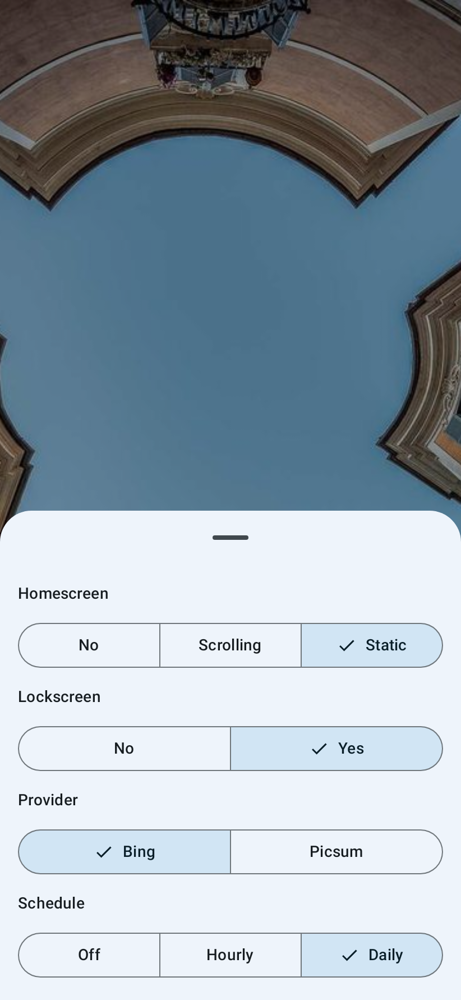

# Auto Wallpaper

An Android application that automatically updates your wallpaper.

## Features

- **Automated Updates**: Change your wallpaper daily or hourly.
- **Multiple Sources**: Support for Bing Wallpaper of the Day and Picsum Photos.
- **Material 3 UI**: Built with Jetpack Compose and modern Material Design principles.

## Screenshots

Show Screenshots

|                                                     Main Screen                                                      |                                                               Settings                                                               |
|:--------------------------------------------------------------------------------------------------------------------:|:------------------------------------------------------------------------------------------------------------------------------------:|
|  |  |

## Technical Stack

- **UI**: Jetpack Compose
- **Dependency Injection**: Koin
- **Background Tasks**: WorkManager
- **Persistence**: DataStore (Preferences)
- **Logging**: Timber
- **Architecture**: MVVM with Clean Architecture principles

## Versioning

- **Automated Versioning**: `MAJOR.MINOR.PATCH`
    - **Major**: Manually incremented in `build.gradle.kts`.
    - **Minor**: Automatically calculated as the number of commits since the last major change.
    - **Patch**: The GitHub Actions run number.
